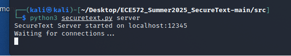
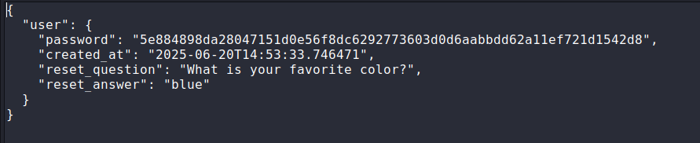
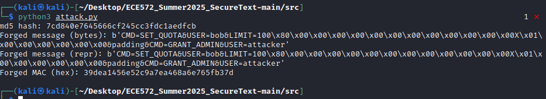

\## Task 1: Security Vulnerability Analysis (25 points)

\### Background

You have been provided with a fully functional but intentionally
insecure console-based messenger application called \"SecureText\"
(located at \`src/securetext.py\`). Your task is to analyze this
application and identify its security vulnerabilities.

\### Requirements

1\. \*\*Run and Explore the Application\*\*:

\- Start the server: \`python3 src/securetext.py server\`

\- Start multiple clients and create accounts

\- Send messages between users

\- Test the password reset functionality

Server started

{width="4.933333333333334in"
height="0.9583333333333334in"}

Created 2 users

{width="5.683333333333334in"
height="4.375in"}

User1 sending message

{width="4.583333333333333in"
height="2.2333333333333334in"}

User2 receiving message

{width="4.091666666666667in"
height="2.025in"}

Reset user's password to password1

And test for login

{width="4.258333333333334in" height="2.95in"}

2\. \*\*Vulnerability Analysis\*\*:

Identify and document \*\*at least 5 major security and privacy
vulnerabilities\*\* in the application. For each vulnerability:

\- \*\*Describe the vulnerability\*\* and its location in the code

\- \*\*Explain the potential impact\*\* if exploited by an attacker

\- \*\*Reference relevant security principles\*\* from course materials

\- \*\*Categorize the vulnerability\*\* (e.g., authentication,
authorization, data protection, etc.)

1\. as any client, I can change the password of any client.

{width="5.025in"
height="2.2916666666666665in"}

{width="5.766666666666667in"
height="1.3083333333333333in"}

The attacker can change the password of any client they see to whatever
they want

Category: Authorization

2\. the password stored in json is not hashed, so that anyone having
access to this file can see all password of all client

{width="5.708333333333333in"
height="2.308333333333333in"}

If the attacker gains access to the server, he can obtain the password
of all client

Category: Confidentiality

3\. the client sending to the server raw data without encryption

{width="5.766666666666667in"
height="1.4666666666666666in"}

A man in the middle can see all the data

Category: Confidentiality

4\. the login request packed raw json data with raw password without
encryption

{width="5.766666666666667in"
height="3.691666666666667in"}

A man in the middle can see the password that is sent

Category: Confidentiality

5\. the create user command stores user by its username and uses this
dump feature that will write whatever is in the following

{width="5.766666666666667in"
height="3.433333333333333in"}

If an attacker continuously creates a user using random username, the
user in the data will be loaded with more and more random useless data.
And the file goes larger and larger and at some point it crashes the
computer

Category: Availability

3\. \*\*Attack Scenarios\*\*:

For each identified vulnerability, describe a realistic client-server
attack scenario explaining:

\- What they would need to carry out the attack

\- What they could achieve if successful

\- Final thoughts and consideration

1\. the attacker may get direct socket connect with the server. He can
manipulate with the password changing request by sending a password
changing request for a target victim using his username. The server will
accept this change and alter the password of that user. Although this
kind of access control break allows the attacker to login and change
password, the victim can simply regain their account by changing it
back. After all, there is no much important data on the account that
needs to be protected. And since anyone can be in any account, if we
remove privacy and authenticity requirement of the server, the system
allows people talks to each other anonymously

2\. as the password in the database is stored in plain text, an attacker
can easily obtain their password as long as they compromise this
machine. The attacker may obtain all the password of all user simply by
copying the json file, so that he would see the username and the
password stored in JSON format. However, since the attacker can simply
change the password by calling a password change, it is relatively
difficulty to stealing all the password in case of having to gain
privilege access of the server

3\. As the code snap shows above, the socket don't preestablish secure
session, it requires the code to set up manually. As a result, if the
attacker performs a man in the middle attack , he will understand the
content of the message simply by looking at it. Also, since this message
doesn't have any signature, he can simply send message to any person on
behalf of anyone simple by sending the packet with his name on it

4\. As the code snap shows above, the socket don't preestablish secure
session. So that the client is sending their password in plaintext to
the attacker. As a result, if the attacker performs a man in the middle
attack , he will understand the content of the message simply by looking
at it. So that as long as the attacker monitor the network activity of a
specific user, he will obtain the password.

5\. the attacker may get direct socket connect with the server. He can
manipulate with the create account request by sending such request where
the account's username is random. The server will accept this change and
append more and more account data. At some point, this will break the
storage capacity of the server and the system goes crash

\### Deliverables

\- \*\*Vulnerability Report\*\*: Detailed analysis of identified
weaknesses

\- \*\*Attack Scenarios\*\*: Realistic exploitation scenarios

\-\--

\## Task 2: Securing Passwords at Rest (25 points)

\### Background

The base application stores user passwords in plaintext, making them
vulnerable if the user database is compromised. You will implement
secure password storage mechanisms.

\### Requirements

\#### Part A: Password Hashing Implementation

1\. \*\*Replace Plaintext Storage\*\*:

\- Modify the \`create_account()\` method to hash passwords before
storing

\- Update the \`authenticate()\` method to compare hashed passwords

\- Use SHA-256 initially, then discuss its limitations

The changed version of \`create_account()\` method

{width="5.766666666666667in"
height="2.2333333333333334in"}

Password created

{width="5.758333333333334in"
height="1.175in"}

Altered authenticate code

{width="5.766666666666667in"
height="1.7666666666666666in"}

Verify

{width="5.766666666666667in" height="2.7in"}

SHA-256 is a fast hash function, so that it is vulnerable to brute-force
attack. attackers can try lots of guesses per second using brute-force
or dictionary attacks to reverse the hashed data.

2\. \*\*Implement Slow Hashing\*\*:

\- Research and implement a slow hash function (PBKDF2, bcrypt, scrypt,
or Argon2)

\- Justify your choice of hash function and parameters

\- Demonstrate the time difference between fast and slow hashing

I have done some research and decided to use bcrypt. bcrypt is a
password-hashing function based on the Blowfish cipher. The bcrypt
requires an extra salt parameter to perform the hash which means it is
specially designed for the passwords

{width="5.766666666666667in"
height="2.558333333333333in"}

The result is shown for password password

{width="5.766666666666667in"
height="1.5166666666666666in"}

Modify the create account function to count the time cost

{width="5.758333333333334in"
height="3.408333333333333in"}

Time cost result

{width="4.591666666666667in"
height="1.125in"}

\#### Part B: Salt Implementation

1\. \*\*Add Salt Generation\*\*:

\- Generate a unique random salt for each user (minimum 128 bits)

\- Store the salt alongside the hashed password

\- Modify authentication to use the stored salt

Since bcrypt has a independent salt parameter requirement, there is no
need to design a specified salt generation mechanism

The modified salt generation algorithm

{width="5.758333333333334in"
height="3.5833333333333335in"}

Salt stored in json

{width="5.766666666666667in"
height="1.3833333333333333in"}

Salt size = 29 byte and 232 bit

{width="4.55in"
height="1.1833333333333333in"}

Modified authentication

{width="5.683333333333334in" height="2.4in"}

Validate

{width="5.641666666666667in"
height="2.966666666666667in"}

2\. \*\*Migration Strategy\*\*:

\- Implement a method to migrate existing plaintext passwords

\- Ensure backward compatibility during the transition

Adding a backward checking mechanism that auto update the old password
into new salted password

{width="5.758333333333334in"
height="2.4916666666666667in"}

\### Attack Demonstration

1\. \*\*Dictionary Attack Simulation\*\*:

\- Create a simple dictionary attack against unsalted hashes

\- Show how salting defeats this attack

\- Demonstrate rainbow table protection

In order to create a simple attack, I shall make a rainbow table of sha
256 with common passwords

First just generate the commonly used passwords

{width="5.766666666666667in"
height="2.5166666666666666in"}

Hashed password

{width="5.366666666666666in"
height="1.2583333333333333in"}

Looking for the screenshot above

{width="5.766666666666667in"
height="1.5166666666666666in"}

hashed password 'password' is not the same as the newly saved 'password'
hash stored in JSON. Since there is a salt in the hashed value, the
result of hashed value are not the same, so that a rainbow table will
not match the password with the existing hashed in JSON

2\. \*\*Performance Analysis\*\*:

\- Compare cracking times for fast vs. slow hash functions

\- Calculate theoretical brute-force times for your implementation

As the prev screenshots shown above

{width="4.591666666666667in"
height="1.125in"}

Fast hashing cost 0 second

And slow hashing cost 0.2148 sec

Assume the password of this system requires 26 small letter + 10 number
and has a length of 8\~10

$$password = 36^{8} + 36^{9} + 36^{10} = 3.76053951*10^{15}$$

As a result,

$$password\ cost\ time = password*cost\ time = 3.76053951*10^{15}*cost\ time$$

For fast hashing

$$password\ cost\ time = password*cost\ time = 3.76053951*10^{15}*0 = 0\ second$$

For slow hashing

$$password\ cost\ time = password*cost\ time = 3.76053951*10^{15}*0.2148 = 0.8077*10^{15}\ seconds$$

\### Deliverables

\- \*\*Updated SecureText\*\*: Version with secure password storage

\- \*\*Migration Script\*\*: Tool to upgrade existing plaintext
passwords

\- \*\*Performance Analysis\*\*: Benchmarks and security analysis

\- \*\*Attack Demonstration\*\*: Evidence of protection against common
attacks

\-\--

\## Task 3: Network Security and Message Authentication (50 points)

\### Background

The application sends messages in plaintext over the network, making
them vulnerable to eavesdropping and tampering. You will implement and
demonstrate these attacks and implement message authentication codes.

\### Requirements

\#### Part A: Network Attack Demonstrations

1\. \*\*Eavesdropping Attack\*\*:

\- Set up network traffic capture using Wireshark or tcpdump

\- Capture and display plaintext messages between users

\- Filter traffic to show only SecureText communication

\- Document the setup and provide evidence (screenshots/logs)

Settled wireshark

Sending message 👊🇺🇸🔥

{width="5.766666666666667in"
height="3.2416666666666667in"}

Capturing message

{width="5.758333333333334in"
height="2.0416666666666665in"}

Filtering with the beginning 8 bit of the data which is {"type":

{width="7.15in"
height="4.118234908136483in"}

2\. \*\*Message Tampering Concept\*\*:

\- Explain how an attacker could intercept and modify messages

\- Describe the tools and techniques needed for active attacks

The attacker may setup a listener that intersepr all packets with the
above filtering feature

And then, they would send a new message with the unchanged header except
the content

\#### Part B: Flawed MAC Implementation

1\. \*\*Implement H(k\|\|m) MAC\*\*:

\- Add a flawed MAC using the construction \`MAC(k,m) = MD5(k\|\|m)\`

\- Implement shared key distribution (simple pre-shared key is
acceptable)

\- Add MAC verification to message processing

The send message with the mac added

{width="5.458333333333333in"
height="4.533333333333333in"}

The default key is the default_key

Verification

{width="7.258333333333334in"
height="2.5416666666666665in"}

2\. \*\*Message Format Enhancement\*\*:

\- Modify messages to support commands(by sending a switch as a function
input) (e.g., \`\"CMD=SET_QUOTA&USER=bob&LIMIT=100\"\`)

\- Ensure the application can process these structured messages as key
value format

\- Implement MAC verification for command messages(keep it simple)

I am doing this by sending a command of type JSON format

{width="7.258333333333334in"
height="3.2083333333333335in"}

By using a JSON phraser I can decode the command in JSON style sent by
messages in a structured format

{width="4.241666666666666in"
height="1.4583333333333333in"}

And the receiver

{width="2.3in"
height="0.8916666666666667in"}

\#### Part C: Length Extension Attack

1\. \*\*Implement Vulnerable MAC\*\*:

\- Implement the flawed MAC construction \`MAC(k,m) = MD5(k\|\|m)\`
exactly as described in course notes

\- Use the Merkle-Damgård construction vulnerability

\- Create a message format that supports commands:
\`\"CMD=SET_QUOTA&USER=bob&LIMIT=100\"\`

The code md5 itself is already md5

{width="5.458333333333333in"
height="4.533333333333333in"}

No needs for changes

The md5 hash for the existing command

{width="4.241666666666666in"
height="1.4583333333333333in"}

320be68d8f209ace6bcd9ddbc421c262

The key is default_key length 11

the original mac

$$mac = MD5(k||m) = H(k|\left| m||padding \right)$$

The mac of new command

$$mac_{new} = MD5(k||m||padding|\left| CMD = {SET}_{QUOTA}\& USER = bob\& LIMIT = 100 \right) = H(k||m||padding|\left| CMD = {SET}_{QUOTA}\& USER = bob\& LIMIT = 100 \right) =$$

$$H(320be68d8f209ace6bcd9ddbc421c262|\left| CMD = {SET}_{QUOTA}\& USER = bob\& LIMIT = 100 \right)$$

So that for

$$m' = m||padding||CMD = {SET}_{QUOTA}\& USER = bob\& LIMIT = 100$$

$$MD5(k|\left| m' \right) = MD5(k|\left| m||padding||CMD = {SET}_{QUOTA}\& USER = bob\& LIMIT = 100 \right) = H(320be68d8f209ace6bcd9ddbc421c262|\left| CMD = {SET}_{QUOTA}\& USER = bob\& LIMIT = 100 \right)$$

2\. \*\*Length Extension Attack Implementation\*\*:

\- Use hash_extender or HashPump tools or implement the length extension
attack from scratch to exploit and run the attack

\- Demonstrate the exact attack scenario from course:

\- Original: \`\"CMD=SET_QUOTA&USER=bob&LIMIT=100\"\`

\- Forged:
\`\"CMD=SET_QUOTA&USER=bob&LIMIT=100&padding&CMD=GRANT_ADMIN&USER=attacker\"\`

\- Show that \`MAC(k, original_msg)\` can be extended to \`MAC(k,
forged_msg)\` without knowing \`k\`

\*\*You need to use packet sniffing tools to get the message first and
then forge and send.\*\*

Since this is an attack I will not write it in the securetext.py file

Implementing extension of md5 using HashTools

{width="6.091666666666667in"
height="3.9728258967629047in"}

Result

{width="7.258333333333334in"
height="1.325in"}

\#### Part D: Secure MAC Implementation

1\. \*\*Replace with Secure MAC\*\*:

\- Implement HMAC-SHA256 or another secure MAC construction

\- Ensure compatibility with existing message format

\- Document why this construction is secure

The altered version with HMAC-SHA256

{width="6.325in" height="4.7in"}

Testing

{width="7.258333333333334in"
height="2.85in"}

The HMAC is resilient from extension attack making sure that the message
having a mac code represents the person who has the key. Although there
is no salt to prevent replay, the construction ensures the one sending
the message must be having the exact key as the one receiving so that
somehow grantees the Authenticity of the message

2\. \*\*Security Analysis\*\*:

\- Explain why HMAC resists length extension attacks

\- Compare the security properties of your implementations

\- Discuss key management considerations

$HMAC(key,\ message)\  = \ H((key\  \oplus \ opad)\ ||\ H((key\  \oplus \ ipad)\ ||\ message))$

Can not be extended with any data, because a extension of the message
results in a extension of the inner hash function. However, since the
inner hash results in arbitrary string of fixed length, as long as the
outer key remains unknown, the hash value can not be predicted.

Now, since the mac functionality is complete, there are still problems
with plain text communication, which can simply resolved by making a
symmetric encryption. Also the exposure of password changing requirement
is still a problem as it still uses the old plaintext password and
anyone can change anyone's password. The key can be created by simply
create some pre-defined message sending protocol for public and private
key exchange protocol. And the key is dropped after the session is
closed
